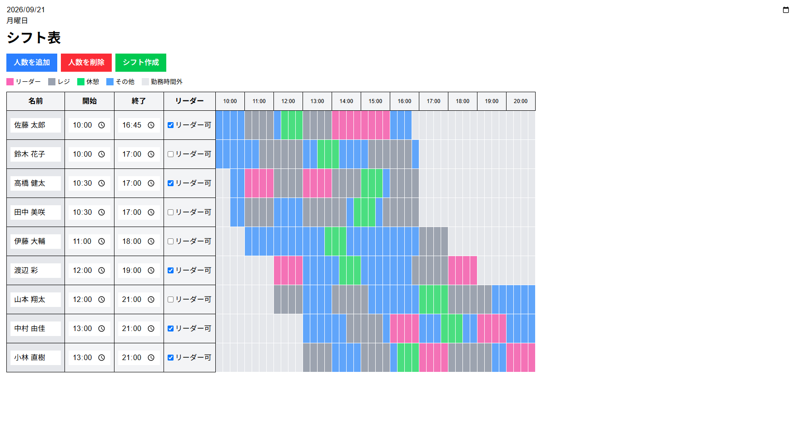
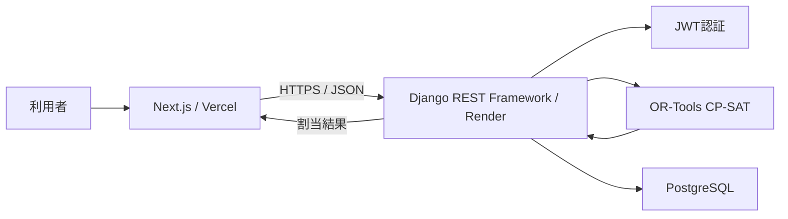

# シフト自動割当アプリ

小売店舗のシフト作成を想定し、従業員の勤務可能時間や担当資格、必要人数などの条件から、各時間帯の担当業務を自動で割り当てるWebアプリケーションです。

手作業では調整が難しい複数の条件を制約として表現し、バックエンドの **Google OR-Tools CP-SAT** で実行可能な割当を探索します。

## デモ

- アプリ: https://shift-phi-beryl.vercel.app/
- バックエンドリポジトリ: https://github.com/matsugeEX/shift_backend

> デモの利用にはログインが必要です。公開用アカウントは、応募書類などで個別に案内する運用を想定しています。

## 動作画面



従業員の勤務時間とリーダー資格を入力し、CP-SATで担当業務を15分単位に自動割当します。

## 開発の背景

小売業務では、単に勤務時間内へ担当を並べるだけでなく、時間帯ごとの必要人数、担当資格、連続勤務時間、休憩などを同時に考える必要があります。

当初は先頭から順に担当を決める貪欲法も検討しましたが、ある時間帯で局所的に条件を満たしても、後の時間帯で人員が不足したり、休憩や連続勤務の条件を満たせなくなったりする問題がありました。そこで、割当全体を一度に評価できる制約充足問題としてモデル化し、CP-SATを採用しました。

## 主な機能

- ユーザー名・パスワードによるログイン
- 従業員の追加・削除
- 従業員名、勤務開始時刻、勤務終了時刻の入力
- リーダー担当資格の設定
- 入力条件に基づくシフトの自動生成
- 15分単位の担当表示
- JWTの有効期限切れを検知したアクセストークン更新とリクエスト再送

### 表示色

| 色 | 担当 |
| --- | --- |
| ピンク | リーダー |
| グレー | レジ |
| グリーン | 休憩 |
| ブルー | その他の業務 |

## システム構成



フロントエンドは従業員情報をJSONで送信し、バックエンドはCP-SATで割当を求解します。結果は従業員ごとの15分単位のスケジュールとして返却され、表形式で色分け表示されます。

## 技術スタック

### フロントエンド

| 分類 | 技術 |
| --- | --- |
| フレームワーク | Next.js 16（Pages Router） |
| 言語 | TypeScript |
| UI | React 19、Tailwind CSS 4 |
| HTTPクライアント | Axios |
| フォーム | React Hook Form |
| ホスティング | Vercel |

### バックエンド

| 分類 | 技術 |
| --- | --- |
| Web API | Django 6、Django REST Framework |
| 最適化 | Google OR-Tools CP-SAT |
| 認証 | Simple JWT、HttpOnly Cookie |
| データベース | PostgreSQL（本番）、MySQL（開発設定） |
| アプリケーションサーバー | Gunicorn |
| ホスティング | Render |

## 実装している制約

現在の実装では、10:00〜21:00を15分単位のスロットに分割し、各従業員・各スロット・各担当についてブール変数を作成しています。

| 制約 | 内容 |
| --- | --- |
| 勤務可能時間 | 勤務開始から終了まで、各スロットに1つの担当を割り当てる |
| リーダー資格 | 資格のない従業員はリーダーに割り当てない |
| リーダー人数 | 11:00〜21:00は常に1名配置する |
| レジ人数 | 11:00〜11:30は2名、11:30〜17:00は3名、17:00〜19:30は2名配置する |
| レジ連続時間 | 1回の担当を60分以上、90分以下とする |
| レジ再配置 | レジ担当終了後60分間は、再びレジへ配置しない |
| 休憩時間 | 勤務時間に応じて0〜75分を付与する |
| 休憩位置 | 勤務開始・終了の前後2時間を避け、18:30以降に休憩を配置しない |
| リーダー連続時間 | 1回の担当を60分以上、180分以下とする |
| 公平性 | リーダー資格者間の担当時間の最大差を最小化する |

### 主要な変数

```text
x[worker, slot, task] = その従業員が、その時間帯に、その業務を担当するか
register_start[worker, slot] = その時間帯からレジ担当を開始するか
break_start[worker, slot] = その時間帯から休憩を開始するか
leader_start[worker, slot] = その時間帯からリーダー担当を開始するか
```

開始位置を表す補助変数を設けることで、担当の連続時間や、担当終了後の再配置禁止を制約として表現しています。

## 工夫した点

### 1. 相互依存する条件をCP-SATで一括して扱う

時間帯ごとに順番に割り当てる方法では、後から必要になる人員や休憩枠を確保できない場合があります。本アプリでは、全時間帯の候補をブール変数として持たせ、必要人数・資格・連続時間・休憩を同一モデル上で評価しています。

### 2. 担当開始・終了を補助変数で検出する

現在と直前のスロットを比較して `register_start` を定義し、レジ担当が始まった場合に一定時間の連続担当を要求しています。同様に担当終了を検出し、その後60分間の再配置を禁止しています。

### 3. 認証情報をJavaScriptから参照できないCookieに保存する

バックエンドはアクセストークンとリフレッシュトークンをHttpOnly Cookieとして発行します。フロントエンドのAxiosインターセプターは401レスポンスを検知すると更新APIを呼び、成功後に元のリクエストを1回だけ再送します。

### 4. 求解結果を画面表示用の形式へ変換する

CP-SATの各ブール変数から、従業員ごとの `time` と `task` の配列を生成して返却します。フロントエンドはこのレスポンスを担当別に色分けして表示します。

## API

バックエンドAPIの詳細は [shift_backend](https://github.com/matsugeEX/shift_backend) を参照してください。

シフト生成では、次の形式で従業員情報を送信します。

```json
{
  "workers": [
    {
      "name": "田中",
      "start": "10:00",
      "end": "21:00",
      "leader": true
    }
  ]
}
```

求解できた場合は、次の形式で結果を受け取ります。

```json
{
  "status": "OPTIMAL",
  "result": [
    {
      "name": "田中",
      "schedule": [
        { "time": "10:00", "task": "other" },
        { "time": "10:15", "task": "other" }
      ]
    }
  ]
}
```

## ローカルでの起動

### 前提

- Node.js
- npm
- 起動済みのバックエンドAPI

### 手順

```bash
git clone https://github.com/matsugeEX/shift.git
cd shift
npm install
```

`.env.local` を作成し、バックエンドのURLを設定します。

```env
NEXT_PUBLIC_API_BASE_URL=http://localhost:8000
```

開発サーバーを起動します。

```bash
npm run dev
```

http://localhost:3000 をブラウザで開きます。

## 今後の改善

- 入力値と重複名のバリデーション
- 求解不能時に原因を理解しやすくするエラー表示
- 必要人数や制約条件を画面から変更できる設定機能
- シフト結果の保存・再編集・CSV出力
- 自動テストの追加
- UIとアクセシビリティの改善
- 公開デモ用アカウントの運用改善

## リポジトリ

- フロントエンド（本リポジトリ）: https://github.com/matsugeEX/shift
- バックエンド: https://github.com/matsugeEX/shift_backend
